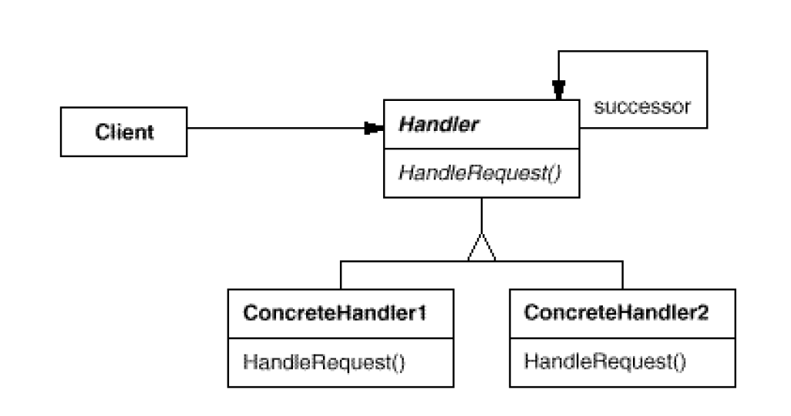
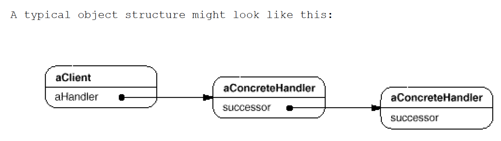

# Chain Of Responsibility: Object that can fulfill a request
`Behavioral`

#### Intent
Avoid coupling the sender of a request to its receiver by giving morethan one
object a chance to handle the request. Chain the receiving objects and pass the
request along the chain until an object handles it.

#### Structure

- Handler (RequestHandler)
	- Defines an interface for handling requests.
	- (optional) implements the successor link.
- ConcreteHandler (OrcCommander, OrcOfficer, OrcSoldier)
	- Handles requests it is responsible for.
	- Can access its successor.
	- If the ConcreteHandler can handle the request, it does so; otherwise forwards the request to its successor.
- Client (Client, OrcKing)
	- Initiates the request to a ConcreteHandler object on the chain.
	
#### Examples
- [Orc-Command-Example](https://github.com/kalyanramswamy/java-design-patterns/tree/master/chain)
- play-booking-dispatcher event processor

#### Rule of thumb
Chain of Responsibility, Command, Mediator, and Observer, address how you can decouple senders and receivers, but with different trade-offs. Chain of Responsibility passes a sender request along a chain of potential receivers.
