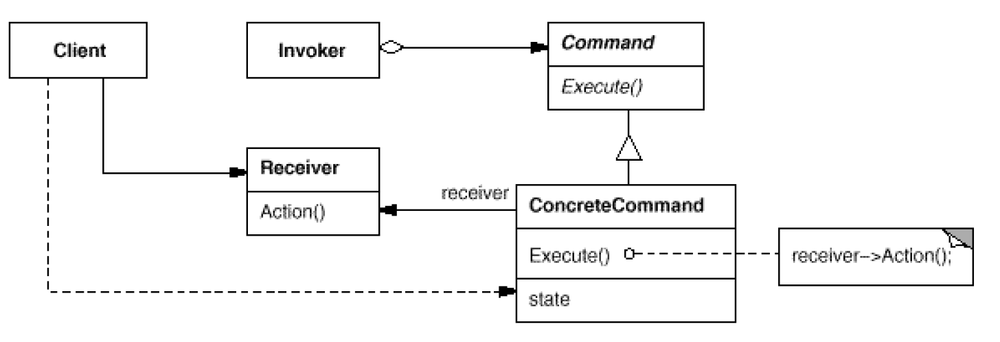

# Command: When and how a request is fulfilled
`Behavioral`

#### Intent
Encapsulate a request as an object, thereby letting you parameterize clients with
different requests, queue or log requests, and support undoable operations.

#### Also Known As
Action, Transaction

#### Structure

- Command
	- Declares an interface for executing an operation.
- ConcreteCommand
	- Defines a binding between a Receiver object and an action.
	- Implements Execute by invoking the corresponding operation(s) on Receiver.
- Client
	- Creates a ConcreteCommand object and sets its receiver.
- Invoker
	- Asks the command to carry out the request.
- Receiver
	- Knows how to perform the operations associated with carrying out a request. Any class may serve as a Receiver.
	
#### Examples
- [Worker-Example](https://sourcemaking.com/design_patterns/command/java/1)
- [File-Example](https://www.baeldung.com/java-command-pattern)
- [Remote-Control-Example](https://www.geeksforgeeks.org/command-pattern/)