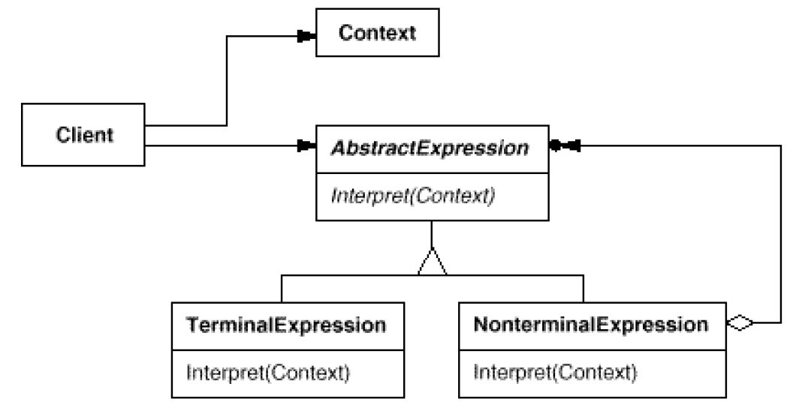

# Interpreter: Grammar and interpretation of a language
`Behavioral`

#### Intent
Given a language, define a representation for its grammar along with an interpreter
that uses the representation to interpret sentences in the language.

#### Structure

- AbstractExpression
	- Declares an abstract Interpret operation that is common to all nodes in the abstract syntax tree.
- TerminalExpression
	- Implements an Interpret operation associated with terminal symbols in the grammar.
	- An instance is required for every terminal symbol in a sentence.
- NonterminalExpression
	- One such class is required for every rule R ::= R1 R2 ... Rn in the grammar.
	- Maintains instance variables of type AbstractExpression for each of the symbols R1 through Rn.
	- Implements an Interpret operation for nonterminal symbols in the grammar. Interpret typically calls itself recursively on the variables representing R1 through Rn.
- Context
	- Contains information that's global to the interpreter.
- Client
	- Builds (or is given) an abstract syntax tree representing a particular sentence in the language that the grammar defines. The abstract syntax tree is assembled from instances of the NonterminalExpression and TerminalExpression classes.
	- Invokes the Interpret operation.
	
#### Example
- [Interpreter Example](https://github.com/kalyanramswamy/java-design-patterns/tree/master/interpreter)