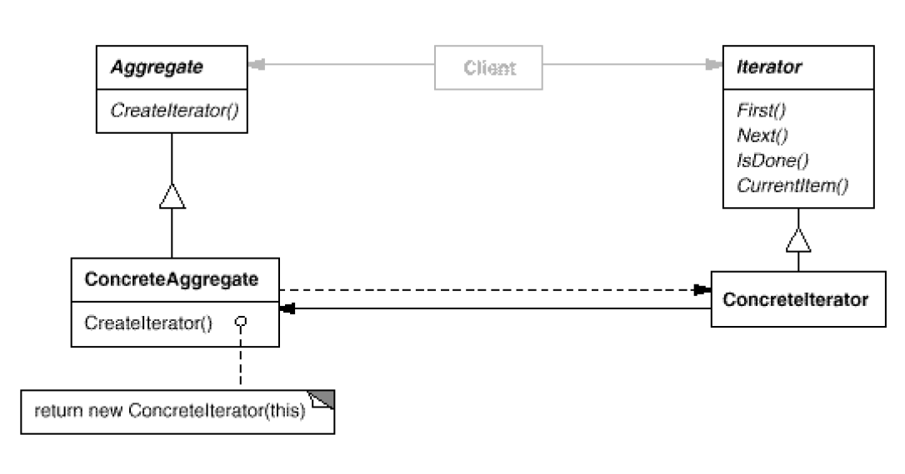

# Iterator: How an aggregate's elements are accessed, traversed
`Behavioral`

#### Intent
Provide a way to access the elements of an aggregate object sequentially without
exposing its underlying representation.

#### Also Know As
Cursor

#### Structure

- Iterator (Iterator)
	- Defines an interface for accessing and traversing elements.
- ConcreteIterator (NotificationIterator)
	- Implements the Iterator interface.
	- Keeps track of the current position in the traversal of the aggregate.
- Aggregate (Collection)
	- Defines an interface for creating an Iterator object.
- ConcreteAggregate (NotificationCollection)
	- Implements the Iterator creation interface to return an instance of the proper Concrete Iterator.

#### Examples
- [Notification-Iterator](https://www.geeksforgeeks.org/iterator-pattern/)
- [why to use iterator](https://sourcemaking.com/design_patterns/iterator/java/1)
	