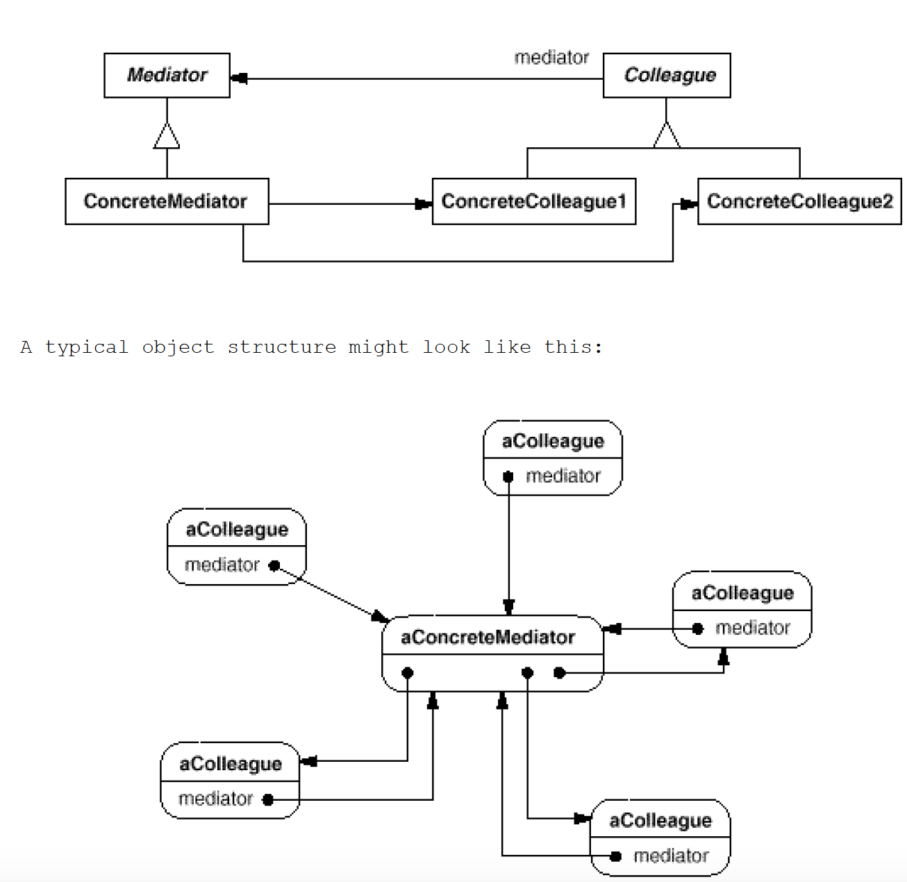

# Mediator: How and which objects interact with each other
`Behavioral`

#### Intent
Define an object that encapsulates how a set of objects interact.Mediator promotes
loose coupling by keeping objects from referring toeach other explicitly, and
it lets you vary their interaction independently.

#### Structure

- Mediator (Party)
	- Defines an interface for communicating with Colleague objects.
- ConcreteMediator (PartyImpl)
	- Implements cooperative behavior by coordinating Colleague objects.
	- Knows and maintains its colleagues.
- Colleague classes (Hobbit, Wizard)
	- Each Colleague class knows its Mediator object.
	- Each colleague communicates with its mediator whenever it would have otherwise communicated with another colleague.
	
	
#### Use the Mediator pattern when

- A set of objects communicate in well-defined but complex ways. The resulting interdependencies are unstructured and difficult to understand
- Reusing an object is difficult because it refers to and communicates with many other objects
- A behavior that's distributed between several classes should be customizable without a lot of subclassing

#### Example
- [Wizerd Party Example](https://github.com/kalyanramswamy/java-design-patterns/tree/master/mediator)
- [Simple Example](https://www.decipherzone.com/blog-detail/mediator-design-pattern)
- [Flight-Runway-Example](https://www.geeksforgeeks.org/mediator-design-pattern/)