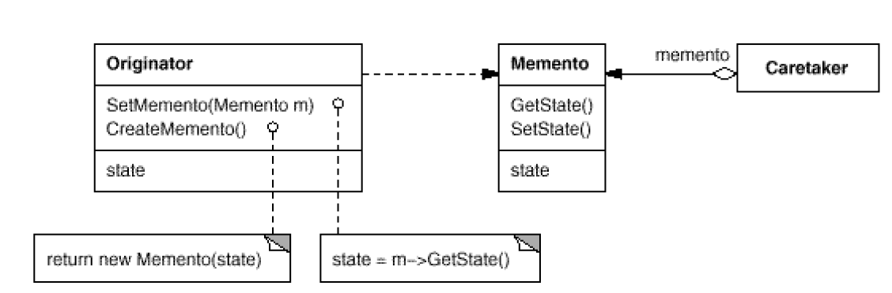

# Memento: What private information is stored outside an object, and when

#### Intent
Without violating encapsulation, capture and externalize an object's internal
state so that the object can be restored to this state later.

#### Also Known As
- Token

#### Use the Memento pattern when
- A snapshot of (some portion of) an object's state must be saved so that it can be restored to that state later, and
- A direct interface to obtaining the state would expose implementation details and break the object's encapsulation.

#### Structure

- Originator: Creates memento for it’s its current internal state.
- Memento: Keeps current state of the Originator object. It’s like a DTO.
- Caretaker: Saves and Restores mementos.

#### Examples
- [File-Save-Example](https://www.journaldev.com/1734/memento-design-pattern-java)
- [Example2 With Explanation](https://medium.com/@sawomirkowalski/design-patterns-memento-f9fc1e127316)