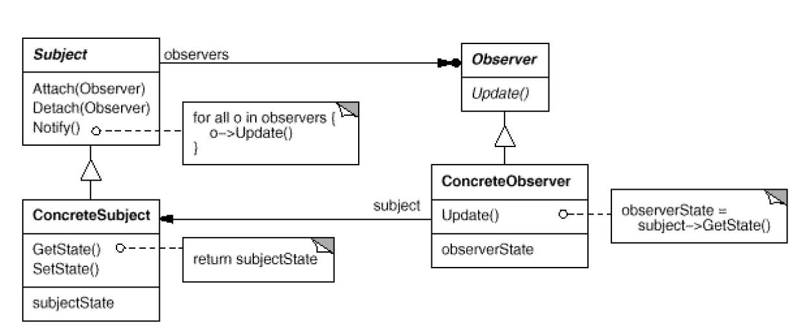

#  Observer: Number of objects that depend on another object; how the dependent objects stay up to date
`Behavioral`

#### Intent
Define a one-to-many dependency between objects so that when one object changes
state, all its dependents are notified and updated automatically.

#### Also Know As
Dependents, Publish-Subscribe

#### Structure

- Subject
	- Knows its observers. Any number of Observer objects may observe a subject.
	- Provides an interface for attaching and detaching Observer objects.
- Observer
	- Defines an updating interface for objects that should be notified of changes in a subject.
- ConcreteSubject
	- Stores state of interest to ConcreteObserver objects.
	- Sends a notification to its observers when its state changes.
- ConcreteObserver
	- Maintains a reference to a ConcreteSubject object.
	- Stores state that should stay consistent with the subject's.
	- Implements the Observer updating interface to keep its state consistent with the subject's.
	
#### Examples
- [Weather-Example](https://github.com/kalyanramswamy/java-design-patterns/tree/master/observer)
- Ride Booking 
