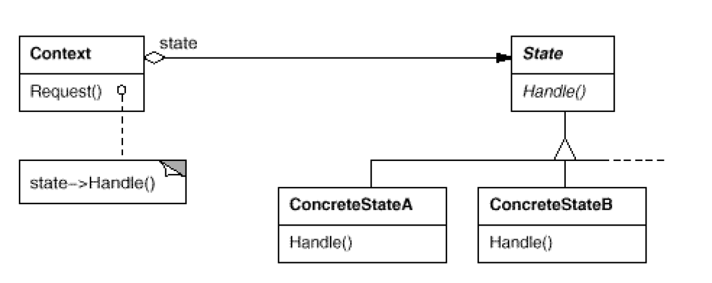

# State: states of an object
`Behavioral`

#### Intent
Allow an object to alter its behavior when its internal state changes. The object will appear to change its class.

#### Also Known As
Objects for States

#### Structure

- Context
	- Defines the interface of interest to clients.
	- Maintains an instance of a ConcreteState subclass that defines the current state.
- State
	- Defines an interface for encapsulating the behavior associated with a particular state of the Context.
- ConcreteState subclasses
	- Each subclass implements a behavior associated with a state of the Context.
	
#### Examples
- Booking States Example
- [Mammoth Mind States](https://github.com/kalyanramswamy/java-design-patterns/tree/master/state)