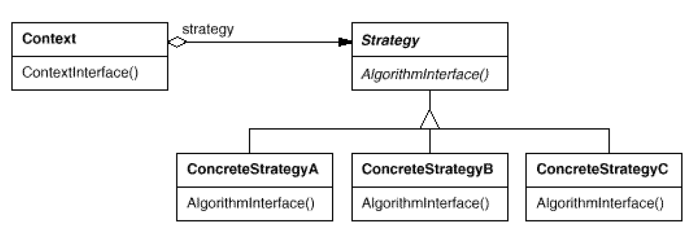

# Strategy: an algorithm
`Behavioral`

#### Intent
Define a family of algorithms, encapsulate each one, and make them interchangeable.
Strategy lets the algorithm vary independently from clients that use it.

#### Also Known As
Policy

#### Structure

- Strategy
	- Declares an interface common to all supported algorithms. Context uses this interface to call the algorithm defined by a ConcreteStrategy.
- ConcreteStrategy
	- Implements the algorithm using the Strategy interface.
- Context
	- Is configured with a ConcreteStrategy object.
	- Maintains a reference to a Strategy object.
	- May define an interface that lets Strategy access its data.
	
#### Example
- Booking Send Strategy