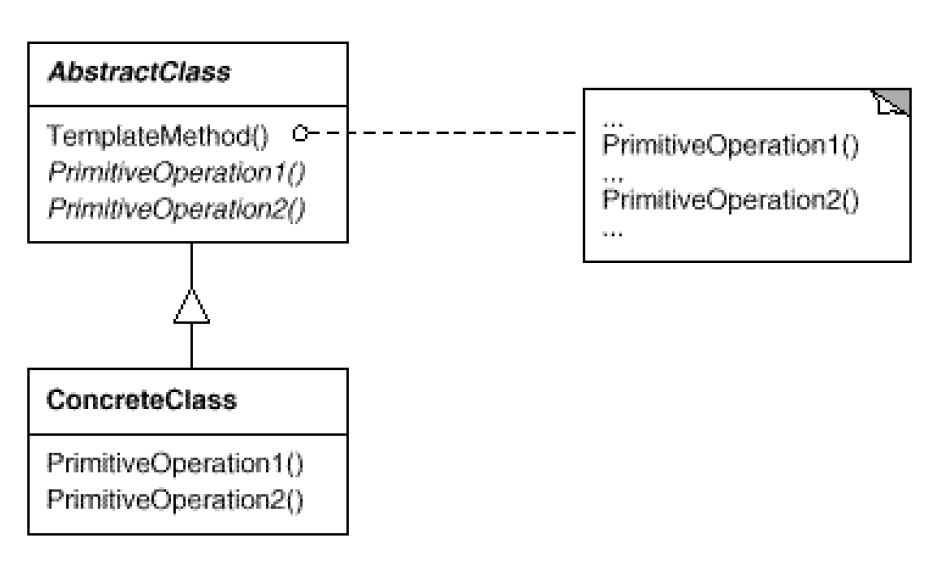

# Template Method: steps of algorithm
`Behavioral`

#### Intent
Define the skeleton of an algorithm in an operation, deferring some steps to
subclasses. Template Method lets subclasses redefine certain steps of an algorithm
without changing the algorithm's structure.

#### Structure

- AbstractClass (AbstractMediaConverter)
	- Defines abstract primitive operations that concrete subclasses define to implement steps of an algorithm.
	- Implements a template method defining the skeleton of an algorithm. 
    The template method calls primitive operations as well as operations defined in AbstractClass or those of other objects.
- ConcreteClass (AudioConverter, VideoConverter)
	- Implements the primitive operations to carry out subclass-specific steps of the algorithm.
	
#### Examples
- Media Converter Template