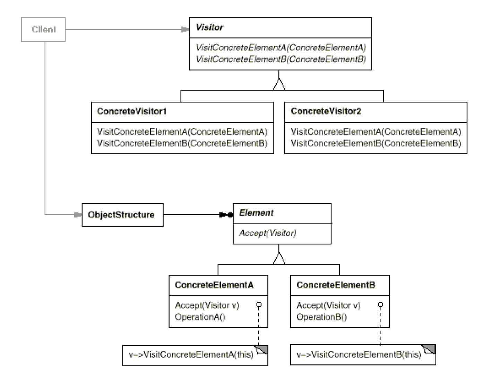

# Visitor: operations that can be applied to object(s) without changing their class(es)
`Behavioral`

#### Intent
Visitor is a behavioral design pattern that lets you separate algorithms from the objects on which they operate.

#### In Simple Words
The main purpose of the Visitor’s pattern is to add new functionalities to an existing object without modifying the class on which the object operates.
As you can see, this pattern does not violate the open-closed principle as you can see on the picture below :)
- [Open-Close Principle](https://medium.com/@severinperez/maintainable-code-and-the-open-closed-principle-b088c737262)

#### Implementation in Simple Words
The implementation in short looks like, the Visitor class declares the visit() method, whose argument is an element of the structure and elements of the structure declare the accept() method, which accepts as argument the Visitor class, the accept() method calls the visit() method in the Visitor class depending on the type of argument passed.

#### Structure

#### Examples
- [Soldier Command Example](https://github.com/kalyanramswamy/java-design-patterns/tree/master/visitor)
- [Explanation](https://medium.com/@sawomirkowalski/design-patterns-visitor-bb59c5883208)

- Visitor (AbstractUnitVisitor)
	- Declares a Visit operation for each class of ConcreteElement in the object structure. The operation's name and signature identifies the class that sends the Visit request to the visitor. That lets the visitor determine the concrete class of the element being visited. Then the visitor can access the element directly through its particular interface.
- ConcreteVisitor (SoldierVisitor, SoldierVisitor, CommanderVisitor)
	- Implements each operation declared by Visitor. Each operation implements a fragment of the algorithm defined for the corresponding class of object in the structure. ConcreteVisitor provides the context for the algorithm and stores its local state. This state often accumulates results during the traversal of the structure.
- Element (AbstractUnit)
	- Defines an Accept operation that takes a visitor as an argument.
- ConcreteElement (Commander, Sergeant, Soldier)
	- Implements an Accept operation that takes a visitor as an argument.
- ObjectStructure (In Client -> unitComposite)
	- Can enumerate its elements.
	- May provide a high-level interface to allow the visitor to visitits elements.
	- May either be a composite or a collection such as a list or a set.

#### Notes
- Visitor cooperates well with Composite and iterator