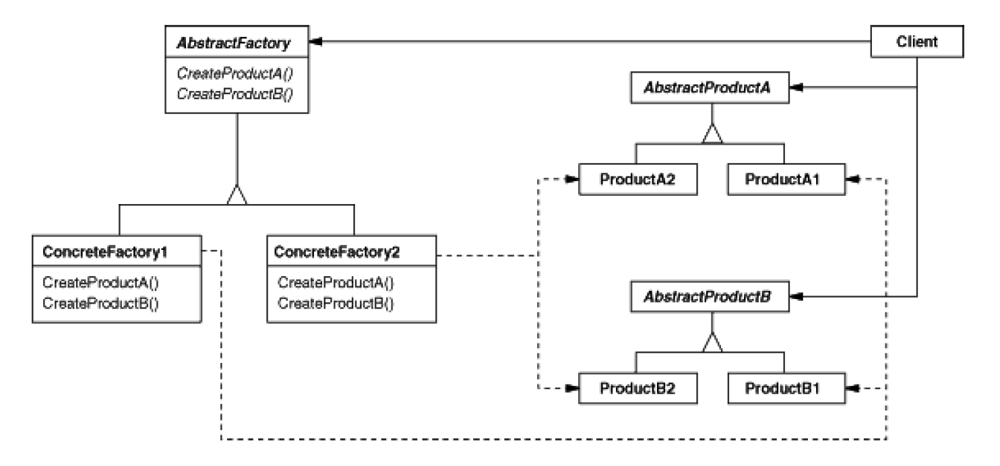

# Abstract Factory: Families of product objects
`Creational`

#### Structure 

- AbstractFactory
	- Declares an interface for operations that create abstract product objects.
- ConcreteFactory
	- Implements the operations to create concrete product objects.
- AbstractProduct
	- Declares an interface for a type of product object.
- ConcreteProduct
	- Defines a product object to be created by the corresponding concrete factory.
	- Implements the AbstractProduct interface.
- Client
	- Uses only interfaces declared by AbstractFactory and AbstractProduct classes.
	
### Examples
- [Elf-orc kingdom](https://github.com/kalyanramswamy/java-design-patterns/tree/master/abstract-factory/src/main/java/com/iluwatar/abstractfactory)