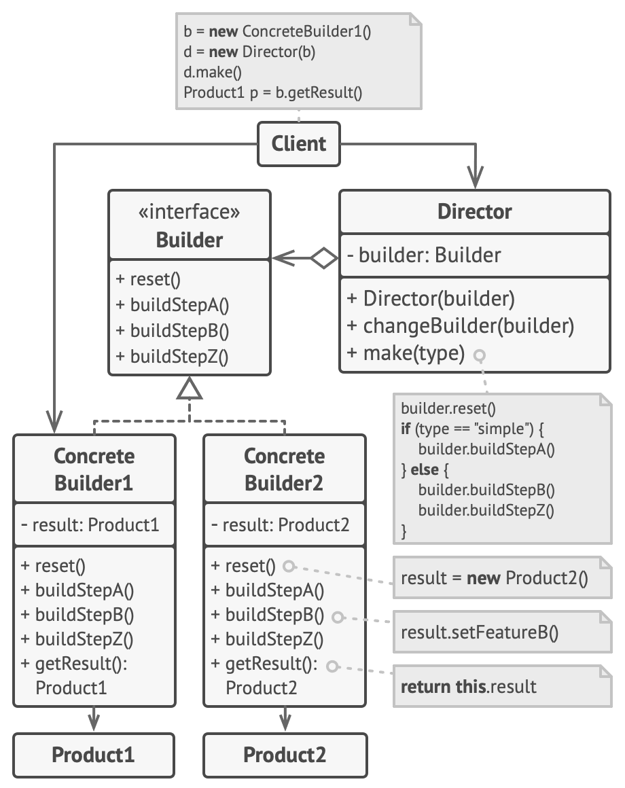

# Builder: How a composite object get created
`Creational`

### Structure


### Defined
- The Builder pattern is an object creation software design pattern with the intentions of finding a solution to the telescoping constructor anti-pattern.
- It simplifies object creation in a very clean and readable way.

### Why, When?
- The builder pattern is useful when there could be several flavours of an object. Or when there are a lot of steps involved in the creation of an object.
- It’s very helpful when we have some model classes with many parameters. It saves us from polluting the object creation using the constructor. i.e,

```
new Pizza(veg: true, cheese: "mozzarella", spicy: false, thinCrust: false, wheatBase: true)
```

- [GeekForGeeks Example](https://www.geeksforgeeks.org/builder-pattern-in-java/)

#### Check list
- **Decide if a common input and many possible representations (or outputs) is the problem at hand.**
- Encapsulate the parsing of the common input in a Reader class.
- Design a standard protocol for creating all possible output representations. Capture the steps of this protocol in a Builder interface.
- Define a Builder derived class for each target representation.
- The client creates a Reader object and a Builder object, and registers the latter with the former.
- The client asks the Reader to "construct".
- The client asks the Builder to return the result.
	
#### Rules of thumb
- Sometimes creational patterns are complementary: Builder can use one of the other patterns to implement which components get built. Abstract Factory, Builder, and Prototype can use Singleton in their implementations.
- Builder focuses on constructing a complex object step by step. Abstract Factory emphasizes a family of product objects (either simple or complex). Builder returns the product as a final step, but as far as the Abstract Factory is concerned, the product gets returned immediately.
- Builder often builds a Composite.
- Often, designs start out using Factory Method (less complicated, more customizable, subclasses proliferate) and evolve toward Abstract Factory, Prototype, or Builder (more flexible, more complex) as the designer discovers where more flexibility is needed.