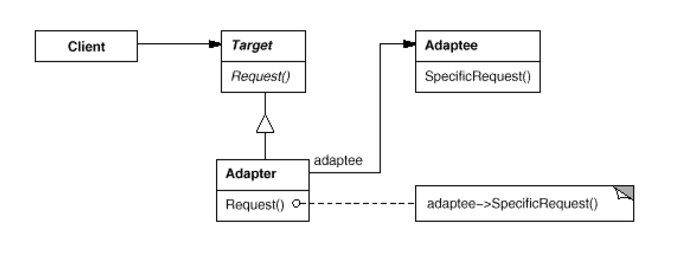

# Adapter: Interface to an **object**
`Structural`

#### Intent
Convert the interface of a class into another interface clients expect. Adapter
lets classes work together that couldn't otherwise because of incompatible
interfaces.

#### Also Known As
Wrapper

#### Classes/objects used in the adapter pattern:

- **Target** — This defines the domain-specific interface that the client uses. This is the Shape interface in our example.
- **Adapter** — This adapts the interface from the adaptee to the target interface. I will point the adapter classes based on the different approach below.
- **Adaptee** — This defines an existing interface that needs adapting. This is the GeometricShape interface in our example.
- **Client** — This collaborates with objects conforming to the Target interface. The Drawing class is the client in our example.

#### Structure 

#### Examples
- [Shape Adaptor](https://dzone.com/articles/adapter-design-pattern-in-java)