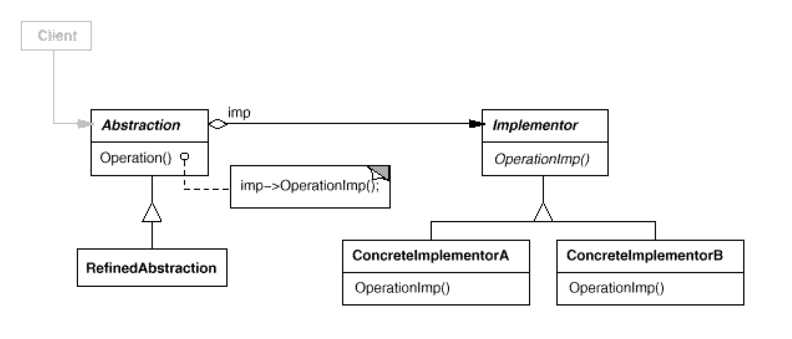

# Bridge: **Implementation** of an object
`Structural`

#### Intent
Decouple an abstraction from its implementation so that the two can vary
independently.

#### Also Known As
Handle/Body

#### Structure

- Abstraction (AbstractWeapon)
	- Defines the abstraction's interface.
	- Maintains a reference to an object of type Implementor.
- RefinedAbstraction (Sword, hammer)
	- Extends the interface defined by Abstraction.
- Implementor (Enchantment)
	- Defines the interface for implementation classes. This interface doesn't have to correspond exactly to Abstraction's interface; in fact the two interfaces can be quite different. Typically the Implementor interface provides only primitive operations, and Abstraction defines higher-level operations based on these primitives.
- ConcreteImplementor (FlyingEnchantment, SoulEatingEnchantment)
	- Implements the Implementor interface and defines its concrete implementation.
	
#### Example
[Weapon-Enchantment Example](https://github.com/kalyanramswamy/java-design-patterns/blob/master/bridge)