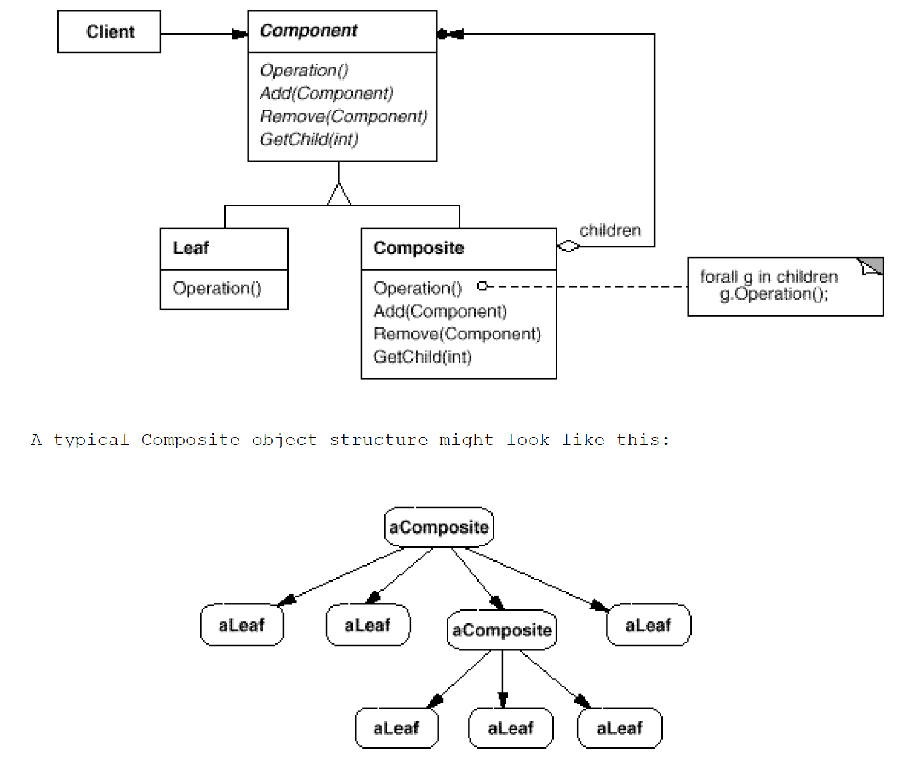

# Composite: **Structure** and composition of an object
`Structural`

#### Intent
Compose objects into tree structures to represent part-whole hierarchies. 
Composite lets clients treat individual objects and compositions of objects uniformly.

#### Real world example
Every sentence is composed of words which are in turn composed of characters. 
Each of these objects is printable and they can have something printed before or after them like sentence always ends with full stop and word always has space before it.

#### Structure

- Component (Employee)
	- Declares the interface for objects in the composition.
	- Implements default behavior for the interface common to all classes, as appropriate.
	- Declares an interface for accessing and managing its child components.
	- (optional) defines an interface for accessing a component's parent in the recursive structure, and implements it if that's appropriate.
- Leaf (Developer, Manager)
	- Represents leaf objects in the composition. A leaf has no children.
	- Defines behavior for primitive objects in the composition.
- Composite (CompanyDirectory)
	- Defines behavior for components having children.
	- Stores child components.
	- Implements child-related operations in the Component interface.
- Client (Client)
	- Manipulates objects in the composition through the Component interface.
	
#### Examples
- [Company-Employee Example](https://www.geeksforgeeks.org/composite-design-pattern/)
- [Words Example](https://github.com/kalyanramswamy/java-design-patterns/tree/master/composite)