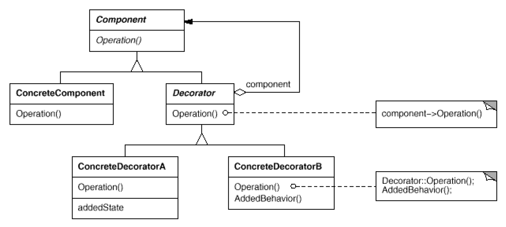

# Decorator: Responsibility of an **object** without subclassing
`Structural`

#### Intent
Attach additional responsibilities to an **object** dynamically. Decorators provide
a flexible alternative to subclassing for extending functionality.

#### Also Known As
- Wrapper

#### Real world example
There is an angry troll living in the nearby hills. 
Usually it goes bare handed but sometimes it has a weapon. 
To arm the troll it's not necessary to create a new troll but to decorate it dynamically with a suitable weapon.

#### In plain words
Decorator pattern lets you dynamically change the behavior of an object at run time by wrapping them in an object of a decorator class.

#### Structure 

- Component (Coffee)
	- defines the interface for objects that can have responsibilities added to them dynamically.
- ConcreteComponent (Espresso, Latte)
	- defines an object to which additional responsibilities can be attached.
- Decorator (CoffeeDecorator)
	- maintains a reference to a Component object and defines an interface that conforms to Component's interface.
- ConcreteDecorator (Milk, Chocolate)
	- adds responsibilities to the component.
	
#### Examples
- [Troll Example](https://github.com/kalyanramswamy/java-design-patterns/tree/master/decorator/src/main/java/com/iluwatar/decorator) (simple)
- [Coffee Example](https://medium.com/@minamed7atg/decorator-design-pattern-b3494339ea93) (advanced)
