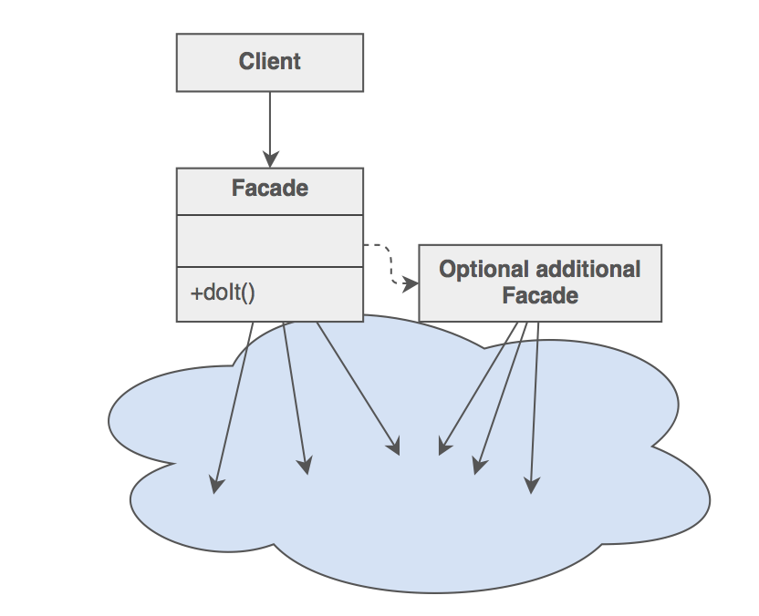

# Facade: Interface to a **subsystem**
`Structural`

#### Intent
- Provide a unified interface to a set of interfaces in a subsystem. Facade defines a higher-level interface that makes the subsystem easier to use.
- Wrap a complicated subsystem with a simpler interface.

#### Structure 

- Facade (OrderFacade)
	- Knows which subsystem classes are responsible for a request.
	- Delegates client requests to appropriate subsystem objects.
	
- Subsystem classes (Waiter, Kitchen)
	- Implement subsystem functionality.
	- Handle work assigned by the Facade object.
	- Have no knowledge of the facade; that is, they keep no references to it.
	
#### Examples
- [Mine Gold](https://github.com/kalyanramswamy/java-design-patterns/tree/master/facade) (advanced)
- [Order Food Example](https://medium.com/@andreaspoyias/design-patterns-a-quick-guide-to-facade-pattern-16e3d2f1bfb6) (simple)

	