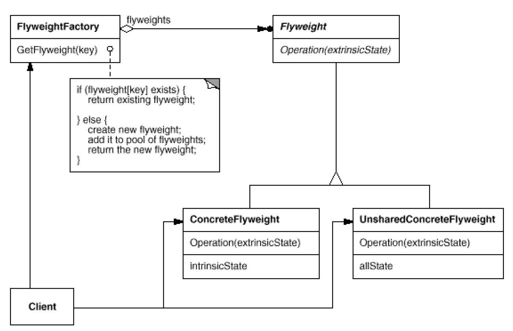
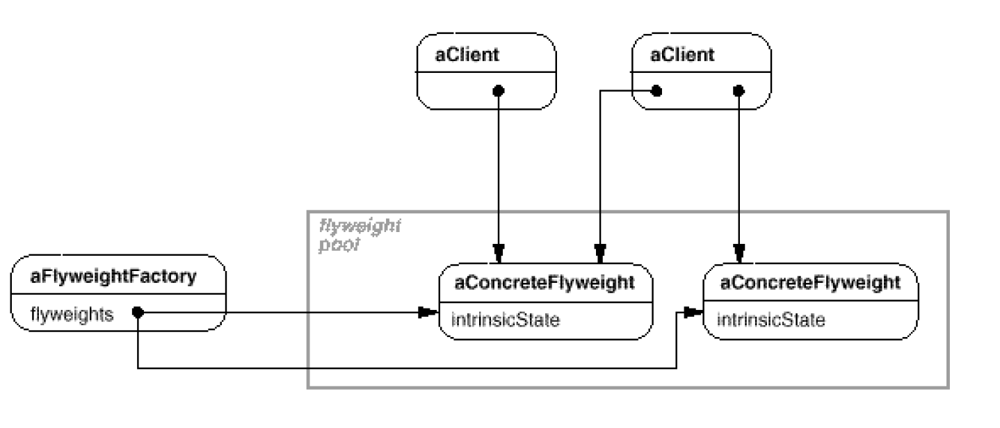

# Flyweight: Storage cost of **objects**
`Structural`

#### Intent
Use sharing to support large numbers of fine-grained objects efficiently.

#### Real world example
Alchemist's shop has shelves full of magic potions. 
Many of the potions are the same so there is no need to create new object for each of them. 
Instead one object instance can represent multiple shelf items so memory footprint remains small.

#### In plain words
It is used to minimize memory usage or computational expenses by sharing as much as possible with similar objects.

#### Structure

The following object diagram shows how flyweights are shared:

- Flyweight
	- Declares an interface through which flyweights can receive and act on extrinsic state.
- ConcreteFlyweight
	- Implements the Flyweight interface and adds storage for intrinsicstate, if any. A ConcreteFlyweight object must be sharable. Any state it stores must be intrinsic; that is, it must be independent of the ConcreteFlyweight object's context.
- UnsharedConcreteFlyweight
	- Not all Flyweight subclasses need to be shared. The Flyweight interface enables sharing; it doesn't enforce it. It's common for UnsharedConcreteFlyweight objects to have ConcreteFlyweight objects as children at some level in the flyweight object structure (as the Row and Column classes have).
- FlyweightFactory
	- Creates and manages flyweight objects.
	- Ensures that flyweights are shared properly. When a client requests a flyweight, the FlyweightFactory object supplies an existing instance or creates one, if none exists.
- Client
	- Maintains a reference to flyweight(s).
	- Computes or stores the extrinsic state of flyweight(s).
	
#### Examples
[Potion Example](https://github.com/kalyanramswamy/java-design-patterns/tree/master/flyweight/src/main/java/com/iluwatar/flyweight)