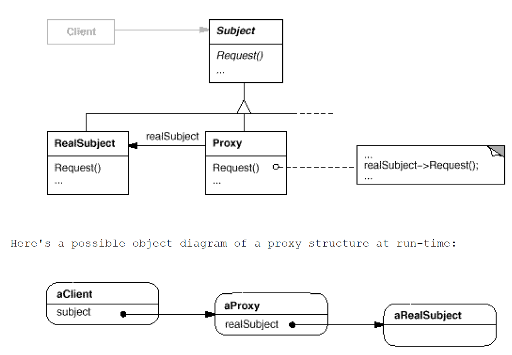

# Proxy: How an object is **accessed**; its location
`Structural`

#### Intent
Provide a surrogate or placeholder for another object to control access to it.

#### Also Known As
Surrogate

#### Real world example
Imagine a tower where the local wizards go to study their spells. 
The ivory tower can only be accessed through a proxy which ensures that only the first three wizards can enter.
Here the proxy represents the functionality of the tower and adds access control to it.

#### In plain words
Using the proxy pattern, a class represents the functionality of another class.

#### The Proxy can be useful for tasks like:
- Logging
- Catching exceptions
- Caching
- Dispatching events before or after some method is called
- Access validation

#### Structure 

- Proxy (ProxyWizardTower)
	- Maintains a reference that lets the proxy access the real subject. Proxy may refer to a Subject if the RealSubject and Subject interfaces are the same.
	- Provides an interface identical to Subject's so that a proxy can by substituted for the real subject.
	- Controls access to the real subject and may be responsible for creating and deleting it.
	- Other responsibilities depend on the kind of proxy:
		- remote proxies are responsible for encoding a request and its arguments and for sending the encoded request to the real subject in a different address space.
		- virtual proxies may cache additional information about the real subject so that they can postpone accessing it. For example, the ImageProxy from the Motivation caches the real image's extent.
		- protection proxies check that the caller has the access permissions required to perform a request.
- Subject (WizardTower)
	- Defines the common interface for RealSubject and Proxy so that a Proxy can be used anywhere a RealSubject is expected.
- RealSubject (IvoryTower)
	- Defines the real object that the proxy represents.
	
#### Examples
- [Wizard Tower](https://github.com/kalyanramswamy/java-design-patterns/tree/master/proxy)